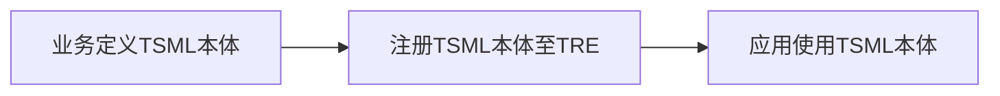
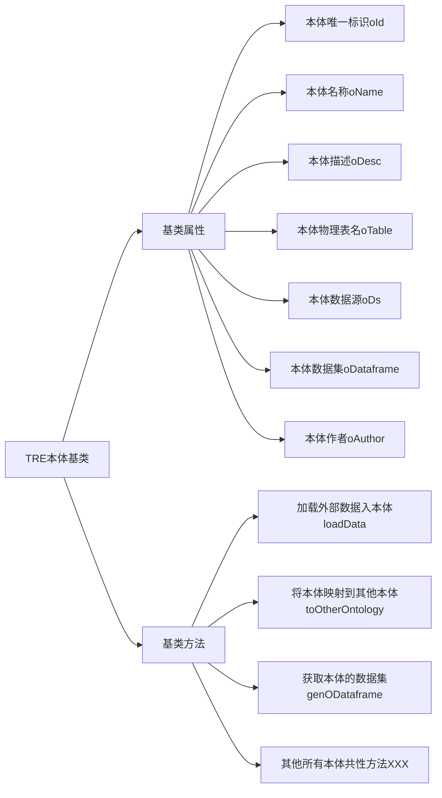
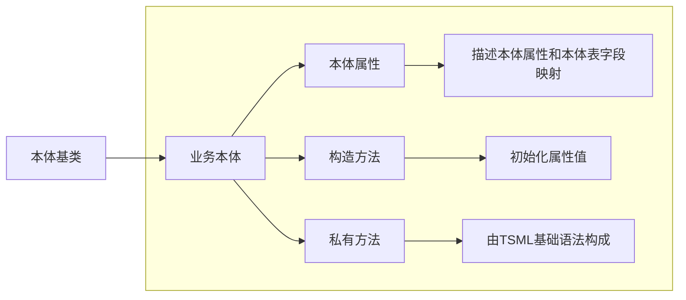

# TSML本体语法定义与开发指导手册

##  1 本体定义使用流程



流程使用说明：

1、业务基于TSML本体定义语法定义本体，每个本体为一个TSML文件，【参见2.4.2】。

2、本体TSML文件通过两种方式注册到TRE引擎，一种通过TRE-SDK的注册接口，另一种通过文件上传到指定目录，TRE自动热加载本体文件，【参见3.1和3.2】。

3、业务在TSML语法中直接创建本体对象，使用本体对象的属性和方法，【参见2.4.3】。

## 2 本体定义语法规范

TRE引擎默认提供一个本体基类，所有业务定义的本体必须继承本体基类，本体基类的定位是用于抽象业务本体的公共属性和公共方法，由TRE统一维护和修订。

### 2.1 本体基类

本体基类提供三个基类方法：loadData()、toOtherOntology()、genODataframe()。

**loadData()：**用于加载外部表数据入本体，该方法入参是一个外部数据集，用户使用时通过TSML基础语法构造好外部数据集，调用此方法给本体注入数据；业务也可以重写此方法实现，内置好本体数据加载逻辑，用户直接开箱即用，【参见2.4.3的示例1和2】；

**toOtherOntology()：**用于本体与本体之间数据的传递，【参见2.4.3的示例5】；

**genODataframe()：**可获取本体的数据集，用于本体和TSML基础算子进一步运算，【参见2.4.3的示例4】；

**depend()：**本体存在外部依赖时，通过此方法设置依赖数据集。

**本体基类结构如下：**


### 2.2 本体建表

本体注册自动建表，元数据信息通过注解注入

表注解@Table参数说明

| 参数名称       | 中文名称 | 参数类型    | 是否必填 | 描述                                       |
| :--------- | ---- | ------- | ---- | ---------------------------------------- |
| remarks    | 表注释  | String  | 否    |                                          |
| type       | 表类型  | String  | 否    | 值为ORC、FRC、MAGICTABLE，FMDB/HIVE默认值为ORC，关系型数据库忽略该参数 |
| readOnly   | 表只读  | boolean | 否    | 表是否只读，默认只读true，只读条件下无法修改本体物理表            |
| properties | 表属性  | 数组      | 否    | 遵守数据库建表语法中的表属性，例如@KeyValue(key="table.ttl", value= "8640000") |

列注解@Column参数说明

| 参数名称               | 中文名称    | 参数类型    | 是否必填 | 描述                                   |
| ------------------ | ------- | ------- | ---- | ------------------------------------ |
| cName              | 列中文名称   | String  | 否    |                                      |
| dataTypeName       | 数据类型名称  | String  | 否    | 默认值为String                           |
| remarks            | 列说明     | String  | 否    |                                      |
| dataLength         | 数据长度    | int     | 否    |                                      |
| decimalDigits      | 小数位     | int     | 否    |                                      |
| nullable           | 是否允许为空  | boolean | 否    | 默认true可为空                            |
| partition          | 是否为分区字段 | boolean | 否    | 默认false非分区                           |
| primaryKey         | 是否主键    | boolean | 否    | 默认false非主键                           |
| originalColumnName | 原始字段名称  | String  | 是    | 仅用于FRC分区字段                           |
| partitionRule      | 分区规则    | String  | 否    | 仅用于FRC分区字段，目前支持 yyyy、yyyyMM、yyyyMMdd |
| positionIndex      | 位置索引    | int     | 否    | 位置索引【经度设置1，维度设置2】，用于自动创建物化视图         |

### 2.3 业务本体

业务本体开发要求：

1、定义本体版本号，版本号：v1、v2、v3...依次自增，在定义的本体类第一行通过package v1来指定版本号；

2、业务本体需要继承本体基类；

3、业务本体需要定义该本体的属性有哪些，属性值为该属性对应的物理表字段名，例如：groupId=“group_id”，本体没有物理表的情况下，属性对应的字段名也需要定义一套虚拟字段名，例如：wxId="wx_id"；

4、业务本体构造方法，需要初始化基类oId、oName、oDesc、oTable、oAuthor属性值，TRE加载时将对属性是否必须进行校验；

| 属性名        | 是否必须 | 规范要求                                     |
| ---------- | ---- | ---------------------------------------- |
| oId        | 是    | 本体唯一标识，约定命名规范：{业务代号}\_{本体分类编码}_{本体编号}。   |
| oName      | 是    | 本体对外的统一中文名称，例如：群聊本体。                     |
| oDesc      | 是    | 本体的描述，可以包含本体的属性描述、本体的方法描述、本体的使用场景等。      |
| oTable     | 否    | 本体对应的物理表名称，如果本体没有对应的物理表名不用赋值，对应的虚拟字段名称直接用属性名称赋值。 |
| oAuthor    | 是    | 本体定义的作者，使用工号填写。                          |
| oDs        | 否    | 本体物理表所在数据源，由应用方使用本体时定义初始化，例如：v1.Chat chat = new v1.Chat(oDs:fmdb)。 |
| oDataframe | 否    | 本体物理表对应的数据集，由loadData()初始化自动赋值。          |

5、业务本体私有方法的开发，私有方法体由TSML基础语法构成，业务可以总结该本体的常用操作进行封装，方便上层应用开箱即用，提升应用效率，【参见2.4.3的示例3】。

**业务本体结构如下：**



### 2.4 TSML本体示例

#### 2.4.1 本体基类示例

业务只能使用，不能自行修改。

```groovy
/**
 * 本体对象基类
 * @version 1.0
 * @date 2025/11/07
 */
abstract class Ontology implements GroovyInterceptable {
    // 本体ID
    String oId
    // 本体名称
    String oName
    // 本体描述
    String oDesc
    // 本体物理表名
    String oTable
    // 本体作者
    String oAuthor
    // 本体物理表所在数据源
    CmdDatasource oDs
    // 本体物理表对应的数据集
    CmdDataframe oDataframe
    // 依赖数据集合
    CmdDataframe[] depends
    // 本体漂移地市
    String[] areaCodes
    // 本体查询数据集
    CmdDataframe queryDataframe
    // 拦截方法的深度
    int depth = 0

    void setoDs(CmdDatasource oDs) {
        // 本体多次设置数据源,卸载掉原数据源算子
        if (this.oDs != null) {
            Register.unregisterOperator(this.oDs.operator)
        }
        // 注册本体时会初始化,该执行直接跳过
        if (Register.getContext() != null) {
            // 生成本体标记算子(用于本体构造)
            def variableName = getVariableInfo().getVariableName() // 获取脚本中对象引用变量
            def ontologyLabel = new OntologyLabel(OntologyLabel.CONSTRUCTOR_CALL, variableName, this.class.name)
            // 给数据源算子打本体构造标记
            oDs.operator.setOntologyLabel(ontologyLabel)
        }
        this.oDs = oDs
    }

    /**
     * 本体新增物理表字段
     *
     * @param columnInfo
     * @return
     */
    Ontology addColumns(String fields) {
        OntologyUtil.addColumns(oDs, oTable, fields)
        return this
    }

    /**
     * 本体删除物理表
     *
     * @param columnInfo
     * @return
     */
    Ontology dropTable() {
        OntologyUtil.dropTable(oDs, oTable)
        return this
    }

    /**
     * 获取本体全部地市的查询结果Dataframe
     *
     * @return
     */
    CmdDataframe getQueryDataframe() {
        // 初始化areaCode
        if (null == areaCodes) {
            areaCode(Register.defaultAreaCode)
        }
        return getQueryDataframe(areaCodes)
    }

    /**
     * 获取本体某地市的查询结果Dataframe
     *
     * @return
     */
    CmdDataframe getQueryDataframe(String... areaCodes) {
        // 初始化本体查询Dataframe
        if (null == queryDataframe) {
            queryDataframe = genODataframe()
        }
        queryDataframe = queryDataframe.ontologyQuery(areaCodes)
        return queryDataframe
    }
    /**
     * 本体依赖的外部数据集
     * @param depends
     */
    void depend(CmdDataframe... depends) {
        this.depends = depends
    }

    Ontology areaCode(String... areaCode) {
        this.areaCodes = areaCode
        return this
    }
    /**
     * 加载外部数据集入本体
     * @param outerData
     * @return 本体数据集
     */
    CmdDataframe loadData(CmdDataframe outerData) {
        oDataframe = oTable == null ? outerData : outerData.to(oDs, oTable)
    }
    /**
     * 将本体映射到其他本体
     * @param other 其他本体
     * @return
     */
    void toOtherOntology(Map mapping, Ontology other) {
        // 1.设置映射关系
        def ontologyThis = genODataframe().mapping(mapping);
        // 2.将本体的结果数据集赋值给其他本体的数据集属性
        other.oDataframe = ontologyThis.to(oDs, other.oTable)
    }
    /**
     * 获取本体的数据集
     * @return
     */
    CmdDataframe genODataframe() {
        if (oTable == null && oDataframe == null) {
            throw new IllegalStateException("该本体没有物理表且未加载数据，请先加载数据后再使用")
        }
        if (null == areaCodes || areaCodes[0] == Register.defaultAreaCode) { // 本地执行
            def fieldMap = OntologyUtil.parseAttributeFieldMapping(this.class)
            def logger = TreLoggerFactory.getLogger()
            logger.info("本体{}属性和字段映射关系,{}", this.class.name, fieldMap)
            return oDataframe != null ? oDataframe.mapping(fieldMap) : from(oDs, this.oTable).mapping(fieldMap)
        } else { // 多地执行
            if (oDataframe != null) {
                return oDataframe
            } else {
                return from(oDs, this.oTable)
            }
        }
    }

    // ==================方法拦截打标========================= //

    Object invokeMethod(String name, Object args) {
        if (name == "beginMethodCall" || name == "endMethodCall") {
            return metaClass.invokeMethod(this, name, args)
        }
//        System.out.println(" Call to  $name  intercepted... ")
        boolean isOutermost = (depth == 0)
        if (isOutermost) {
            // 获取脚本中对象引用变量和本体类名
            List<VariableInfo> variableInfos = Register.getContext().getProperty("VariableInfo")
            if (Util.isEmpty(variableInfos)) {
                throw new RuntimeException("脚本中未解析出本体类" + this.class.name)
            }
            VariableInfo variableInfo
            for (VariableInfo variable : variableInfos) {
                if (variable.getClassName().equals(this.class.name)) {
                    variableInfo = variable
                    break
                }
            }
            if (variableInfo == null) {
                throw new RuntimeException("脚本中未解析出本体类" + this.class.name)
            }
            beginMethodCall(variableInfo.getVariableName(), name, args)
        }
        depth++
        Object result
        try {
            result = metaClass.invokeMethod(this, name, args)
        } finally {
            depth--
            if (isOutermost) {
                endMethodCall(name)
                depth = 0
            }
        }
        return result
    }

    void beginMethodCall(String variableName, String methodName, Object args) {
//        System.out.println("start")
        if (areaCodes != null && (areaCodes[0] != Register.defaultAreaCode || areaCodes.size() > 1)) {
            // 处理方法参数
            List<Object> methodArgs
            if (args == null) {
                methodArgs = new ArrayList<>()
            } else {
                def length = Array.getLength(args)
                methodArgs = new ArrayList<>(length)
                for (int i = 0; i < length; i++) {
                    methodArgs.add(Array.get(args, i))
                }
            }
            // 注册本体标记
            OntologyLabel label = new OntologyLabel(OntologyLabel.METHOD_CALL, variableName, this.class.name, methodName, methodArgs)
            Register.getContext().getProperties().putIfAbsent("ontologyLabel", label)
        }
    }

    void endMethodCall(String methodName) {
//        System.out.println("end")
        // 卸载本体标记
        Register.getContext().getProperties().remove("ontologyLabel")
    }

    // ==================查询语法========================= //

    void init() {
        // 初始化areaCode
        if (null == areaCodes) {
            areaCode(Register.defaultAreaCode)
        }
        // 初始化本体查询Dataframe
        if (null == queryDataframe) {
            queryDataframe = genODataframe()
        }
    }

    Ontology select(String... columnExprs) {
        init()
        queryDataframe = queryDataframe.select(columnExprs)
        return this
    }

    Ontology mapping(Map<String, String> exprs) {
        init()
        queryDataframe = queryDataframe.mapping(exprs)
        return this
    }

    Ontology where(String whereExpr) {
        init()
        queryDataframe = queryDataframe.where(whereExpr)
        return this
    }

    Ontology sort(String... orderColumns) {
        init()
        queryDataframe = queryDataframe.sort(orderColumns)
        return this
    }

    Ontology index(String index) {
        init()
        queryDataframe = queryDataframe.index(index)
        return this
    }

    Ontology limit(int offset = 0, int size) {
        init()
        queryDataframe = queryDataframe.limit(offset, size)
        return this
    }

    Ontology distinct(String... distinctColumns) {
        init()
        queryDataframe = queryDataframe.distinct(distinctColumns)
        return this
    }

    Ontology to(CmdDatasource datasource, String targetTableName) {
        init()
        queryDataframe = queryDataframe.to(datasource, targetTableName)
        return this
    }

    Ontology to(CmdDatasource datasource, String targetTableName, String targetTableFields) {
        init()
        queryDataframe = queryDataframe.to(datasource, targetTableName, targetTableFields)
        return this
    }

    Ontology nodeId(String nodeId) {
        init()
        queryDataframe = queryDataframe.nodeId(nodeId)
        return this
    }

    // ==================插入、更新、删除语法========================= //
    /**
     * 本体插入数据
     * @param record
     * @return
     */
    Ontology save(Map<String, Object> record) {
        if (oTable == null) {
            throw new RuntimeException("本体没有物理表,无法插入数据")
        }
        OntologyUtil.save(this.class.name, oDs, oTable, record)
        return this
    }
 
    /**
     * 本体删除数据
     * @param expr
     * @return
     */
    Ontology delete(String expr) {
        if (oTable == null) {
            throw new RuntimeException("本体没有物理表,无法删除数据")
        }
        OntologyUtil.delete(oDs, oTable, expr)
        return this
    }

    // ==================返回结果语法========================= //

    Ontology returnDf() {
        init()
        def tempTableName
        if (queryDataframe.operator instanceof ToOperator) {
            tempTableName = ((ToOperator) queryDataframe.operator).targetTableName
        } else {
            tempTableName = genOntologyTempTableName()
            queryDataframe = queryDataframe.to(oDs, tempTableName)
        }
        queryDataframe = queryDataframe.ontologyQuery(areaCodes)

        // 本地本体查询去记录结果表信息
        if (areaCodes.size() == 1 && areaCodes[0] == Register.defaultAreaCode) {
            def areaCode = areaCodes[0]
            def dbType = ((DatasourceOperator) oDs.operator).getDsInfo().getType().name
            def dbResourceId = ((DatasourceOperator) oDs.operator).getDsInfo().getDbResourceId()
            def db = ["resultTable": tempTableName, "dbType": dbType, "dbResourceId": dbResourceId, "ontoClass": this.class.name]
            def resultTableMap = Register.getContext().getTask().getResultTables()
            if (resultTableMap.containsKey(areaCode)) {
                resultTableMap.get(areaCode).add(db)
            } else {
                def list = new ArrayList<Map<String, String>>()
                list.add(db)
                resultTableMap.put(areaCode, list)
            }
        }
        return this
    }

    /**
     * 获取脚本中对象信息(变量和方法调用链)
     * @return
     */
    VariableInfo getVariableInfo() {
        // 获取脚本中对象引用变量和本体类名
        List<VariableInfo> variableInfos = Register.getContext().getProperty("VariableInfo")
        if (Util.isEmpty(variableInfos)) {
            throw new RuntimeException("脚本中未解析出本体类" + this.class.name)
        }
        for (VariableInfo variableInfo : variableInfos) {
            if (variableInfo.getClassName().equals(this.class.name)) {
                return variableInfo
            }
        }
        throw new RuntimeException("脚本中未解析出本体类" + this.class.name)
    }

}
```

#### 2.4.2 业务本体示例

示例说明：Chat本体提供了filterKeywords业务方法，以及默认提供外部数据加载逻辑方法loadData()。

```groovy
package v1
/**
 * 群聊本体
 */
@Table(type="ORC", remarks="微信群聊")
class Chat extends Ontology {

    // 本体属性和本体表字段映射关系定义
    @Column(dataTypeName="string", remarks="群标识")
    String groupId = "group_id"
    @Column(dataTypeName="string", remarks="微信标识")
    String wxId = "wx_id"
    @Column(dataTypeName="string", remarks="聊天内容")
    String content = "content"

    Chat() {
        // 初始化本体基础属性
        super.oId = "TS_00001_00001"
        super.oName = "群聊本体"
        super.oDesc = "群聊本体包含属性：群组ID（groupId）、微信ID（wxId）、聊天内容（content）"
        super.oTable = "tre.t_chat"
        super.oAuthor = "X0001"
        super.oDs = fmdb()
    }
    /**
     * 内置全部外部数据加载逻辑
     * @return 本体数据集
     */
    CmdDataframe loadData() {
        def tChatInterface = from(oDs, "t_chat_interface")
        // 存在依赖的话，可以指定依赖
        if(depends != null && depends.length > 0){
            tChatInterface.depend(depends)
        }
        def prepData = tChatInterface.where("i_group_id = 100000")
                .mapping((groupId): "i_group_id",
                        (wxId)    : "i_wx_id",
                        (content) : "i_content"
                )
        super.loadData(prepData)
    }
    /**
     * 内置部分外部数据加载逻辑
     * @return 本体数据集
     */
    @Override
    CmdDataframe loadData(CmdDataframe outerData) {
        // 1.必须要加载的数据集
        def tChatInterface = from(oDs, "t_chat_interface2")
        // 存在依赖的话，可以指定依赖
        if(depends != null && depends.length > 0){
            tChatInterface.depend(depends)
        }
        def innerData = tChatInterface.where("i_group_id = 20000")
                .mapping((groupId):"i_group_id",
                        (wxId):"i_wx_id",
                        (content):"i_content"
                )
        // 2.与外部数据集进行并集并去重
        def result = innerData.union(outerData).distinct()
        // 3.合并后结果入本体Chat
        super.loadData(result)
    }
    /**
     * 查找包含指定关键词的群有哪些
     * @param keywords 关键词
     * @param tableName 结果输出的表名
     */
    def filterKeywords(String keywords,String tableName){
        // 1.获取群聊本体数据集
        def fromOntology = genODataframe()
        // 2.对群聊本体数据集进行数据提取
        def result = fromOntology.where("content like '%${keywords}%'")
                .select("groupId, wxId, content")
        // 3.将处理结果result输出到定义表
        def A = result.to(oDs, tableName)
      	// 4.结果赋值给父类的查询结果集属性
      	super.queryDataframe = A
      	return this
    }
}
```

#### 2.4.3 业务使用示例

1.使用默认方法加载外部表到本体表

```groovy
// 脚本调度周期
periodReactor("0 0/3 * * * ?")

def fmdb = fmdb()
// 使用v1版本的Chat本体
v1.Chat chat = new v1.Chat(oDs:fmdb)
def tChat2 = from(fmdb, "t_chat_2")
def beforeData = tChat2.where("i_group_id = 100000").to(fmdb,"t_chat_interface")
// 设置本体依赖
chat.depend(beforeData)
// 使用默认方法加载外部表到对象表
chat.loadData()
```

2.业务自定义加载外部表到本体表业务逻辑

```groovy
def fmdb = fmdb()
v1.Chat chat = new v1.Chat(oDs:fmdb)
// 业务自定义加载外部表到对象表业务逻辑
// 1.提取群聊对象接口表数据
def tChatInterface = from(chat.oDs, "t_chat_interface")
// 2.对t_chat_interface表进行数据处理
def outerData = tChatInterface.where("i_group_id = 200")
            .mapping((chat.groupId):"i_group_id",
                    (chat.wxId):"i_wx_id",
                    (chat.content):"i_content"
            )
// 3.将outerData加载到本体中
chat.loadData(outerData)
```

3.使用本体业务方法对本体进行分析

```groovy
def fmdb = fmdb()
v1.Chat chat = new v1.Chat(oDs:fmdb)
// 使用默认方法加载外部表到本体表
chat.loadData()
// 使用本体的过滤方法
def df1 = chat.filterKeywords("毒品","t_chat_result")
```

4.使用本体数据集和TSML基础算子进行直接分析

```groovy
def fmdb = fmdb()
v1.Chat chat = new v1.Chat(oDs:fmdb)
// 使用默认方法加载外部表到本体表
chat.loadData()
// 使用本体数据集和TSML基础算子进行直接分析
def pDf = from(fmdb,"t_chat_interface2").alias("a")
def oDf = chat.genODataframe().alias("b")
def poDf = pDf.join(oDf,"a.i_wx_id = b.wxId").select("a.i_wx_id","b.content")
poDf.to(fmdb,"t_chat_result2")
```

5.使用基类本体间传递方法实现本体间数据的传递

```groovy
def fmdb = fmdb()
// 创建Chat本体
v1.Chat chat = new v1.Chat(oDs:fmdb)
// 使用默认方法加载外部表到本体表
chat.loadData()
// 创建Chat2本体
v1.Chat2 chat2 = new v1.Chat2(oDs:fmdb)
// 定义Chat2本体属性和Chat本体属性映射关系
def mapping = [(chat2.groupId): chat.groupId,
               (chat2.wxId)   : chat.wxId,
               (chat2.content): chat.content]
// 将本体chat数据传递给chat2
chat.toOtherOntology(mapping, chat2)
```

6.多个本体数据入一个本体

```groovy
def fmdb = fmdb()
// 创建Chat本体
v1.Chat chat = new v1.Chat(oDs:fmdb)
// 将多个本体数据入到本体Chat中
// 1.本体Chat1数据集
v1.Chat1 vchat1 = new v1.Chat1(oDs:fmdb)
def df1 = chat1.genODataframe().mapping((chat.groupId):groupId,
                                        (chat.wxId):wxId,
                                        (chat.content):content
                                       )
// 2.本体Chat2数据集
v1.Chat2 chat2 = new v1.Chat2(oDs:fmdb)
def df2 = chat2.genODataframe().mapping((chat.groupId):groupId,
                                        (chat.wxId):wxId,
                                        (chat.content):content
                                       )
// 3.本体Chat1和Chat2进行并集并去重
def result = df1.union(df2).distinct()
chat.loadData(result)
```

7.使用本体操作物理表

```groovy
def fmdb = fmdb()
v1.Chat chat = new v1.Chat(oDs:fmdb)
// 追加表字段
chat.addColumns("ip1 string, ip2 int comment 'ip地址'")
// 删除本体物理表
chat.dropTable();
```


## 3 本体管理

### 3.1 接口注册

TRE对外提供的SDK JAR包中增加了本体注册接口和本体卸载接口。

```java
// 1.本体注册接口，重名的本体注册提示已存在
RegisterRsp treClient.registerOntology(String tsml)

// 2.本体删除接口
RegisterRsp treClient.unregisterOntology(String names)
    
// 3.批量本体注册接口，支持本体间相互依赖场景
RegisterRsp treClient.registerOntologies(List<String> tsmls)
    
/**
 * 4.批量更新本体
 * TRE将根据给定的新本体代码,覆盖已注册的对应旧本体,如果新本体未注册的则注册.
 * 风险提示:更新接口不判断本体的继承关系和依赖情况,如果
 *         1.修改父类属性或方法参数,子类没有一起提交更新的;
 *         2.修改有依赖本体其中的一方,另一方没有一起提交更新的;
 *         运行本体任务时可能会失败,需本体更新提交方(BDOS)排查原因并解决。
 * @param tsmls
 * @return
 */
RegisterRsp treClient.updateOntologies(List<String> tsmls)
```

注册接口入参：
| 属性   | 类型     | 描述       |
| ---- | ------ | -------- |
| tsml | String | 本体TSML代码 |

删除接口入参说明：

| 属性    | 类型     | 描述                                      |
| ----- | ------ | --------------------------------------- |
| names | String | 包含版本号的本体名称，多个用逗号分隔,例如:"v1.Chat,v1.Http" |

RegisterRsp注册接口返回：

| 属性    | 类型   | 描述                                                         |
| ------- | ------ | ------------------------------------------------------------ |
| status  | int    | 本体注册状态，0：注册失败，1：注册成功，2：部分成功          |
| message | String | 本体注册成功或者失败时的描述信息。例如：<br />成功：本体注册成功<br />失败：本体XXX名称已经被占用，请重新定义本体名称 |
| data    | Object | 批量注册和批量更新时返回Map<String,String>结果。key是本体名称，<br />value是注册或注销结果, 成功的会提示成功, 失败的会提示具体失败原因 |

### 3.2 上传文件注册

​	【步骤1】将本体TSML保存成文件，文件命名规范约束如下：本体名称.tsml，例如：Chat.tsml。

​	【步骤2】上传路径为：/home/tre/temp/ontology/offline/，其中/home/tre/temp/路径，可通过TRE配置文件tre.properties里的tre.temp.file.path配置项查看，路径默认值为/home/tre/temp/。文件上传之后就可以在tsml语法中直接使用了。

 

## 4 本体CURD语法定义

### 4.1 本体插入数据

**save()：** 用于插入数据到本体

```groovy
/**
 * 【语法说明】
 * 本体：用本体对象变量引用表示
 * 属性集合:本体属性和值的映射集合,如[name:"xiaoming",age:"12"]
 */
本体.save(属性集合)
/**【用法示例】**/
// save
v1.Chat chat = new v1.Chat(oDs:fmdb)
chat.save([id:"1",name:"xiaoming",age:"12"])
```

### 4.2 本体删除数据

**delete()：**用于删除本体的数据

```groovy
/**
 * 【语法说明】
 * 本体：用本体对象变量引用表示
 * 条件：遵循sql的条件语法规范
 */
本体.delete(属性集合)
/**【用法示例】**/
// delete
v1.Chat chat = new v1.Chat(oDs:fmdb)
chat.delete("id = 1")
```

### 4.3 本体更新数据

**update()：**用于更新本体的数据

```groovy
/**
 * 【语法说明】
 * 本体：用本体对象变量引用表示
 * 属性集合:本体属性和值的映射集合,如[name:"xiaoming",age:"12"]
 * 条件：遵循sql的条件语法规范
 */
本体.update(属性集合)
/**【用法示例】**/
// update
v1.Chat chat = new v1.Chat(oDs:fmdb)
chat.update("id = 1",[name:"xiaoming",age:"12"])
```

### 4.4 本体查询数据

#### 4.4.1 基础查询

##### 4.4.1.1 过滤算子

**where()**

针对本体的行内容进行过滤，用法如下：

```groovy
/**
 * 【语法说明】
 * 本体：用本体对象变量引用表示
 * 过滤条件：遵循sql的where条件语法规范
 * 返回值：为自定义数据集名称，后续对数据集的引用，可用数据集变量代替 
 */
def 数据集 = 本体.where("过滤条件")

/**【用法示例】**/
// 对本体进行过滤
v1.Chat chat = new v1.Chat(oDs:fmdb)
def df = chat.where("age >0 and age < 150")
```

**select()**

针对本体的列（字段）进行过滤，用法如下：

```groovy
/**
 * 【语法说明】
 * 本体：用本体对象变量引用表示
 * 过滤字段表达式：遵循sql的select语法规范，多个字段可用逗号隔开的一个参数传递，也可以多个参数传递
 * 返回值：为自定义数据集，后续对数据集的引用，可用数据集变量代替 
 */
def 数据集 = 本体.select("过滤字段表达式1"[,"过滤字段表达式2"])

/**【用法示例】**/
//对本体进行过滤
v1.Chat chat = new v1.Chat(oDs:fmdb)
def dataset = chat.select("age","name as person_name","replace(email,'@fh.com','@fiberhome.com') as email")
```

**mapping()**

针对本体的列（字段）进行过滤，类同select()，更直观的展示过滤字段和其别名，用法如下：

```groovy
/**
 * 【语法说明】
 * 本体：用本体对象变量引用表示
 * 过滤字段表达式：遵循sql的select语法规范，多个字段可用逗号隔开的一个参数传递
 * 返回值：为自定义数据集，后续对数据集的引用，可用数据集变量代替 
 */
def 数据集 = 本体.mapping(别名: "过滤字段表达式1"[,别名: "过滤字段表达式1"])

/**【用法示例】**/
//对数据集进行过滤
v1.Chat chat = new v1.Chat(oDs:fmdb)
def dataset = chat.mapping(
  age: "age",
  person_name: "name",
  email: "replace(email,'@fh.com','@fiberhome.com')"
)
```

##### 4.4.1.2 聚合算子

**group()**

支持分组聚合，并使用各类聚合算子，用法如下：

```groovy
/**
 * 【语法说明】
 * 分组字段：支持直接指定字段名称，多个字段逗号隔开，也可以嵌套函数，函数遵循sql规范
 * 聚合表达式：聚合表达式中可以写1个或多个聚合函数表达式，表达式规范遵循sql规范
 * 目前支持的函数的有：count()、min()、max()、sum()、avg()
 * 返回值：返回聚合操作之后的新数据集
 */
def 数据集 = 本体.group("分组字段", "聚合表达式")

/**【用法示例】**/
v1.Chat chat = new v1.Chat(oDs:fmdb)
// 数据集分组, 按照身份证号分组, 统计每个人的手机号数量
def datasetA = chat.group("sex", "count(sex) as count_sex")
//SQL语法中group后的having，等价于where，使用where代替
def datasetB = chat.group("sex", "count(sex) as count_sex").where("count_sex > 10")
def datasetC = chat.group("class,sex", "avg(age) as ave_age")
// 合并行操作
/**
 * concat_ws 函数说明
 * 样例：concat_ws('###',sort_array(collect_list(mobile))) 
 * ###：合并行的字段内容的分隔符,mobile：合并行的字段
 */
def datasetD = chat.group("idNo,name,age", "concat_ws('###',sort_array(collect_list(mobile))) as mobile")


```

##### 4.4.1.3 排序算子

**sort()**

对记录进行排序，用法如下：

```groovy
/**
 * 【语法说明】
 * 排序字段：字段名 asc|desc
 * index （可选）: 在淘沙场景下，排序后的数据集中，会增加一列序号字段。
 * 返回值：返回排序后的新数据集
 */
def 数据集 = 本体.sort("排序字段1"[, "排序字段2"])[.index("序号字段名")]

/**【用法示例】**/
v1.Chat chat = new v1.Chat(oDs:fmdb)
// 根据id_no降序和age升序,对记录排序
def dataset = chat.sort("idNo desc", "age asc")
//排序后增加一列排序字段，字段名为rowNum
def dataset = chat.sort("idNo desc", "age asc").index("rowNum")
```

##### 4.4.1.4 分页算子
**limit()**

限制查询结果条数，用法如下：

```groovy
/**
 * 【语法说明】
*  起始位置: 记录下标,第一条是0
 * 查询条数：要控制返回的记录条数
 * 返回值：新数据集
 */
def 数据集 = 本体.limit([起始位置,] 查询条数)

/**【用法示例】**/
v1.Chat chat = new v1.Chat(oDs:fmdb)
// top n
def datasetA = chat.limit(1000)
// paging
def datasetB = chat.limit(0,50)
```

##### 4.4.1.5 去重算子

**distinct()**

对数据去重，用法如下：

```groovy
/**
 * 【语法说明】
*  去重字段: 用于判断记录重复的字段,可选,不填则全部字段去重
 * 返回值：新数据集
 */
def 数据集 = 本体.distinct([去重字段1,去重字段2,...])

/**【用法示例】**/
v1.Chat chat = new v1.Chat(oDs:fmdb)
// 全量字段去重
def datasetA = chat.distinct()
// 指定字段去重
def datasetB = chat.distinct("idNo","name")
```

#### 4.4.2 漂移查询

本体基类提供基类方法设置漂移地市：areaCode()。

**areaCode()：**用于设置本体漂移的地市，该方法入参是字符串可变长参数

```groovy
/**
 * 【语法说明】
 * 本体：用本体对象变量引用表示
 * 地市编码：指定本体的漂移地市,字符串可变长参数
 */
本体.areaCode("地市编码A","地市编码B")
/**【用法示例】**/
v1.Chat chat = new v1.Chat(oDs:fmdb)
chat.areaCode("320100","320200")
chat.where("id = 1")
```

#### 4.4.3 返回查询结果

本体基类提供基类方法返回查询结果：returnDf()。

**returnDf()：**用于将本体的查询结果集返回给调用客户端，用法如下：

```groovy
/**
 * 【语法说明】
 * 数据集：需要返回的数据集，用数据集变量引用表示
 */
本体.returnDf()

/**【用法示例】**/
v1.Chat chat = new v1.Chat(oDs:fmdb)
chat.where("id = 1")
chat.returnDf()
```

### 4.3 本体查询结果分析

​	本体查询结果与基础算子结合进行分析使用。

​	需要使用本体基类提供的基类方法获取查询结果集：getQueryDataframe()

​	**getQueryDataframe():**  获取本体查询结果数据集CmdDataframe

```groovy
/**
 * 【语法说明】
 * 本体：用本体对象变量引用表示
 * 地市编码：指定本体的漂移地市，为空表示获取本体指定的所有漂移地市查询结果集
 */
def df = 本体.getQueryDataframe("地市编码A","地市编码B")
/**【用法示例】**/
v1.Chat chat = new v1.Chat()
chat.areaCode("320100","320200")
chat.where("id = 1")
def df = chat.getQueryDataframe()
def fmdb = fmdb().areaCode("320100")
df.where("name = 'xiao'").to(fmdb,"result_table")
```


## 5 本体使用方式

### 5.1 SDK调用方式

#### 5.1.1 查询本体信息

TRE对外提供的SDK JAR包中增加了获取本体查询接口。

```java
/**
 * 查询本体信息
 * @param fullOntologyNames 指定本体完整名称,多个逗号分隔,不传查询全部本体
 * @return 本体信息列表
 */
public abstract List<OntoInfoRsp> getOntologies(String fullOntologyNames);
```

接口入参：

| 属性                | 类型     | 描述                              |
| ----------------- | ------ | ------------------------------- |
| fullOntologyNames | String | 指定本体完整名称,多个逗号分隔,不传(给null)查询全部本体 |

List<OntoInfoRsp>查询接口返回本体：

| 属性              | 类型               | 描述                                       |
| --------------- | ---------------- | ---------------------------------------- |
| oId             | String           | 本体ID                                     |
| oName           | String           | 本体名称                                     |
| oDesc           | String           | 本体描述                                     |
| oTable          | String           | 本体物理表名                                   |
| oAuthor         | String           | 本体作者                                     |
| version         | String           | 版本(对应package)                            |
| className       | String           | 本体类名称(不包含包名)                             |
| parentClass     | String           | 父类,完整路径,为null表示继承java.lang.Object或者集成tre的本体基类tre.Ontology,是递归停止条件 |
| fields          | List<OntoField>  | 本体属性                                     |
| -\|fieldName    | String           | 本体属性名称                                   |
| -\|fieldType    | String           | 属性类型,java数据类型                            |
| -\|columnName   | String           | 列名称                                      |
| -\|dataTypeName | String           | 数据类型名称，默认值为String                        |
| -\|remarks      | String           | 列说明                                      |
| methods         | List<OntoMethod> | 本体方法信息                                   |
| -\|methodName   | String           | 方法名称                                     |
| -\|methodDesc   | String           | 方法描述                                     |
| -\|returnType   | String           | 返回值类型                                    |
| -\|params       | String[]         | 方法参数列表, 包含参数类型和参数名                       |

List<OntoInfoRsp>样例：

```
[
    {
      "oId": "TS_00001_00001",
      "oName": "群聊本体",
      "oDesc": "群聊本体包含属性：群组ID（groupId）、微信ID（wxId）、聊天内容（content）",
      "oTable": "t_chat",
      "oAuthor": "X0001",
      "version": "v1",
      "className": "Chat",
      "parentClass": null,
      "fields": [
        {
          "fieldName": "groupId",
          "fieldType": "java.lang.String",
          "columnName": "group_id",
          "dataTypeName": "string",
          "remarks": "群标识"
        },
        {
          "fieldName": "wxId",
          "fieldType": "java.lang.String",
          "columnName": "wx_id",
          "dataTypeName": "string",
          "remarks": "微信标识"
        },
        {
          "fieldName": "content",
          "fieldType": "java.lang.String",
          "columnName": "content",
          "dataTypeName": "string",
          "remarks": "聊天内容"
        }
      ],
      "methods": [
        {
          "methodName": "loadData",
          "methodDesc": " 内置全部外部数据加载逻辑\n @return 本体数据集",
          "returnType": "CmdDataframe",
          "params": []
        },
        {
          "methodName": "loadData",
          "methodDesc": " 内置部分外部数据加载逻辑\n @return 本体数据集",
          "returnType": "CmdDataframe",
          "params": [
            "CmdDataframe outerData"
          ]
        },
        {
          "methodName": "filterKeywords",
          "methodDesc": " 查找包含指定关键词的群有哪些\n @param keywords 关键词\n @param tableName 结果输出的表名",
          "returnType": "java.lang.Object",
          "params": [
            "String keywords",
            "String tableName"
          ]
        }
      ]
    }
  ]
```

#### 5.1.2 提交任务

同sdk提交tsml脚本任务方式， 参考 tre集成指导手册V1.4 第4章节提交任务部分。

#### 5.1.3 获取本体查询结果

TRE对外提供的SDK JAR包中增加了获取本体查询结果接口。

```java
// 获取本体查询结果
TaskResult treClient.getTaskResult(String taskId)
```

接口入参：

| 属性     | 类型     | 描述       |
| ------ | ------ | -------- |
| taskId | String | 本体查询任务ID |

TaskResult查询接口返回本体：

| 属性                  | 类型                        | 描述             |
| ------------------- | ------------------------- | -------------- |
| status              | String                    | 查询任务状态         |
| result              | List                      | 查询结果           |
| -\|areaCode         | String                    | 本体查询的地市        |
| -\|code             | String                    | 本体查询响应编码       |
| -\|msg              | String                    | 本体查询响应信息       |
| -\| data            | List<Map<String, Object>> | 数据内容           |
| -\|  metadata       | List                      | 元数据            |
| -\| columnIndex     | int                       | 列下标            |
| -\| columnName      | String                    | 列名称            |
| -\| dataTypeName    | String                    | 字段数据库层面类型:类型名称 |
| -\| jdbcType        | int                       | 字段jdbc类型       |
| -\| columnLength    | int                       | 字段长度           |
| -\| decimalDigits   | int                       | 精度             |
| -\| remarks         | String                    | 注释             |
| -\| nullable        | boolean                   | 是否允许为空         |
| -\| defaultValue    | String                    | 默认值            |
| -\| partition       | boolean                   | 是否为分区字段        |
| -\| primaryKey      | boolean                   | 是否为主键          |
| -\| autoGenerated   | boolean                   | 是否自增长          |
| -\| primaryKeyIndex | int                       | 主键序号           |

status任务状态字典:

| 状态码              | 名称       |
| ---------------- | -------- |
| NEW              | 新建       |
| PENDING          | 等待中      |
| RUNNING          | 运行中      |
| FINISHED         | 结束（全部成功） |
| PARTIAL_SUCCESS  | 结束（部分成功） |
| EXCEPTION        | 结束（全部异常） |
| MANUAL_STOPPED   | 手动停止     |
| OVERTIME_STOPPED | 超时停止     |
| CANCELLED        | 取消执行     |

code响应编码字典：

| 状态码      | 名称      |
| -------- | ------- |
| TRE_2000 | 成功      |
| TRE_0101 | 本体未注册   |
| TRE_0102 | 数据库执行失败 |
| ...      | ...     |

TaskResult样例：

```
{
	"status": "PARTIAL_SUCCESS",
	"result": [{
		"areaCode": "320100",
		"code": "TRE_2000",
		"msg": "成功",
		"data": [{
			"name": "xiaoming"
		},
		{
			"name": "xiaohong"
		}],
		"metadata": [{
			"columnIndex": 1,
			"columnName": "name",
			"remarks": "姓名",
			"dataTypeName": "varchar",
			"jdbcType": 12,
			"columnLength": 255
		}]
	},
	{
		"areaCode": "320200",
		"code": "TRE_0100",
		"msg": "本体未注册",
		"data": [],
		"metadata": []
	}]
}
```

### 

### 5.2 Http接口调用方式

#### 5.2.1 查询本体信息

**服务接口地址：**

http://[IP]:[PORT]/tre/api/getOntologies

**请求类型：**

GET

**请求头：**

需要传递token，与api请求相同，可联系tre获取

tre-token=xxxx

接口入参：

| 属性                | 类型     | 描述                       |
| ----------------- | ------ | ------------------------ |
| fullOntologyNames | String | 指定本体完整名称,多个逗号分隔,不传查询全部本体 |
| areaCode          | String | 地市编码，不传默认查询服务节点所在地市编码    |

Respone查询接口返回本体：

| 属性   | 类型                | 描述                                   |
| ---- | ----------------- | ------------------------------------ |
| code | int               | 结果码，0：请求成功，-1：请求失败                   |
| msg  | String            | 请求结果：操作成功/操作失败                       |
| data | List<OntoInfoRsp> | 返回的本体信息，同5.1.1章节下List<OntoInfoRsp>结构 |

Respone样例：

```
{
  "code": 0,
  "msg": "操作成功",
  "data": [
    {
      "oId": "TS_00001_00001",
      "oName": "群聊本体",
      "oDesc": "群聊本体包含属性：群组ID（groupId）、微信ID（wxId）、聊天内容（content）",
      "oTable": "t_chat",
      "oAuthor": "X0001",
      "version": "v1",
      "className": "Chat",
      "parentClass": null,
      "fields": [
        {
          "fieldName": "groupId",
          "fieldType": "java.lang.String",
          "columnName": "group_id",
          "dataTypeName": "string",
          "remarks": "群标识"
        },
        {
          "fieldName": "wxId",
          "fieldType": "java.lang.String",
          "columnName": "wx_id",
          "dataTypeName": "string",
          "remarks": "微信标识"
        },
        {
          "fieldName": "content",
          "fieldType": "java.lang.String",
          "columnName": "content",
          "dataTypeName": "string",
          "remarks": "聊天内容"
        }
      ],
      "methods": [
        {
          "methodName": "loadData",
          "methodDesc": " 内置全部外部数据加载逻辑\n @return 本体数据集",
          "returnType": "CmdDataframe",
          "params": []
        },
        {
          "methodName": "loadData",
          "methodDesc": " 内置部分外部数据加载逻辑\n @return 本体数据集",
          "returnType": "CmdDataframe",
          "params": [
            "CmdDataframe outerData"
          ]
        },
        {
          "methodName": "filterKeywords",
          "methodDesc": " 查找包含指定关键词的群有哪些\n @param keywords 关键词\n @param tableName 结果输出的表名",
          "returnType": "java.lang.Object",
          "params": [
            "String keywords",
            "String tableName"
          ]
        }
      ]
    }
  ],
  "success": true
}
```


### 5.3 MCP调用方式

#### 5.3.1 MCP使用配置

**mcp服务地址：**

http://[IP]:[PORT]/tre/mcp/service

**MCP类型：**

可流式传输的HTTP(streamableHttp)

#### 5.3.2 MCP下发本体执行脚本工具

mcp工具方法一般为大模型调用，通过mcp工具获取

**工具方法名：**

start_task

**输入参数：**

| 参数名                     | 类型      | 说明                                       |
| ----------------------- | ------- | ---------------------------------------- |
| **traceId**             | string  | 链路标识,非必填                                 |
| **bussinessId**         | string  | 业务标识, BDP应用菜单编码,必填,默认AI-MCP              |
| **codeId**              | string  | TSML脚本标识,非必填                             |
| **code**                | string  | TSML脚本内容, 必填                             |
| **userLevel**           | string  | 任务优先级,值[1-9], 值越大优先级越高,TRE默认3,非必填        |
| **modelId**             | string  | 模型业务标识,必填，无标识则填入uuid                     |
| **maxRunTime**          | string  | 实时任务最大运行时间,单位:天,仅实时任务生效;不传时,TRE默认7天,非必填  |
| **resumeFromException** | boolean | 任务执行异常,再次提交或下次周期运行时,是否继续上次异常节点重新运行,非必填   |
| **params**              | string  | 脚本参数,非必填,多个参数分割,举例：xx1=xx;xx2=xxx        |
| **userId**              | string  | 用户标识,非必填                                 |
| **extractEngine**       | string  | 实时任务标识,tornadoF平台会把有相同标识的模型进行统一优化处理,非必填，多个标识分号分割，举例：type=FZ;xxx=xxx |
| **tableTtl**            | string  | 分区数据保留时间,单位:秒,仅实时任务生效;不传时,TRE默认86400秒即1天,非必填 |

**使用样例：**

通过大模型工具下发任务，如果需要返回数据，代码中必须要有returnDf()，以cherrystudio为例：


**返回结果：**

"{\"taskId\":\"2365fb670aad4d748975c48d48d84ebf\"}"

#### 5.3.3 MCP获取本体查询结果

mcp工具方法一般为大模型调用，通过mcp工具获取

**工具方法名：**

get_task_result

**输入参数：**

| 参数名        | 类型     | 说明      |
| ---------- | ------ | ------- |
| **taskId** | string | 任务id,必填 |

**使用样例：**

通过大模型工具下发任务，以cherrystudio为例：


**返回结果：**

同5.1.1 获取本体查询结果返回的结果

#### 5.3.4 通过TSML获取DAG图

mcp工具方法一般为大模型调用，通过mcp工具获取

**工具方法名：**

get_tsml_to_dag

**输入参数：**

| 参数名      | 类型     | 说明        |
| -------- | ------ | --------- |
| **code** | string | TSML脚本,必填 |

**使用样例：**

通过大模型工具下发任务，以cherrystudio为例：


**返回结果：**

返回结果为点线边信息，可以使用butterfly-dag插件进行图片展示，图结果如下：


返回数据结果如下：

```
{
    "canvas": {
        "edges": [
            {
                "arrow": true,
                "arrowPosition": 1,
                "hasRadius": true,
                "shapeType": "AdvancedBezier",
                "source": "bottom",
                "sourceNode": "operator-1",
                "target": "top",
                "targetNode": "operator-3",
                "type": "endpoint"
            },
            {
                "arrow": true,
                "arrowPosition": 1,
                "hasRadius": true,
                "shapeType": "AdvancedBezier",
                "source": "bottom",
                "sourceNode": "operator-3",
                "target": "top",
                "targetNode": "operator-4",
                "type": "endpoint"
            },
            {
                "arrow": true,
                "arrowPosition": 1,
                "hasRadius": true,
                "shapeType": "AdvancedBezier",
                "source": "bottom",
                "sourceNode": "operator-4",
                "target": "top",
                "targetNode": "operator-5",
                "type": "endpoint"
            },
            {
                "arrow": true,
                "arrowPosition": 1,
                "hasRadius": true,
                "shapeType": "AdvancedBezier",
                "source": "bottom",
                "sourceNode": "operator-5",
                "target": "top",
                "targetNode": "operator-6",
                "type": "endpoint"
            },
            {
                "arrow": true,
                "arrowPosition": 1,
                "hasRadius": true,
                "shapeType": "AdvancedBezier",
                "source": "bottom",
                "sourceNode": "operator-6",
                "target": "top",
                "targetNode": "operator-7",
                "type": "endpoint"
            },
            {
                "arrow": true,
                "arrowPosition": 1,
                "hasRadius": true,
                "shapeType": "AdvancedBezier",
                "source": "bottom",
                "sourceNode": "operator-7",
                "target": "top",
                "targetNode": "operator-8",
                "type": "endpoint"
            }
        ],
        "groups": [],
        "nodes": [
            {
                "endpoints": [
                    {
                        "id": "bottom",
                        "orientation": [
                            0,
                            1
                        ],
                        "pos": [
                            0.5,
                            0.0
                        ]
                    }
                ],
                "id": "operator-1",
                "label": "1_fmdb_default",
                "left": 232,
                "operator": "FmdbDsOperator",
                "status": "unknown",
                "top": 74,
                "type": "dataSource"
            },
            {
                "endpoints": [
                    {
                        "id": "top",
                        "orientation": [
                            0,
                            -1
                        ],
                        "pos": [
                            0.5,
                            0.0
                        ]
                    },
                    {
                        "id": "bottom",
                        "orientation": [
                            0,
                            1
                        ],
                        "pos": [
                            0.5,
                            0.0
                        ]
                    }
                ],
                "id": "operator-3",
                "label": "3_from massdata.DWS_PER_NUL_HIS_CONTACT",
                "left": 232,
                "operator": "FromOperator",
                "status": "unknown",
                "top": 148,
                "type": "table"
            },
            {
                "endpoints": [
                    {
                        "id": "top",
                        "orientation": [
                            0,
                            -1
                        ],
                        "pos": [
                            0.5,
                            0.0
                        ]
                    },
                    {
                        "id": "bottom",
                        "orientation": [
                            0,
                            1
                        ],
                        "pos": [
                            0.5,
                            0.0
                        ]
                    }
                ],
                "id": "operator-4",
                "label": "4_mapping",
                "left": 232,
                "operator": "MappingOperator",
                "status": "unknown",
                "top": 222,
                "type": "unknown"
            },
            {
                "endpoints": [
                    {
                        "id": "top",
                        "orientation": [
                            0,
                            -1
                        ],
                        "pos": [
                            0.5,
                            0.0
                        ]
                    },
                    {
                        "id": "bottom",
                        "orientation": [
                            0,
                            1
                        ],
                        "pos": [
                            0.5,
                            0.0
                        ]
                    }
                ],
                "id": "operator-5",
                "label": "5_where",
                "left": 232,
                "operator": "WhereOperator",
                "status": "unknown",
                "top": 296,
                "type": "unknown"
            },
            {
                "endpoints": [
                    {
                        "id": "top",
                        "orientation": [
                            0,
                            -1
                        ],
                        "pos": [
                            0.5,
                            0.0
                        ]
                    },
                    {
                        "id": "bottom",
                        "orientation": [
                            0,
                            1
                        ],
                        "pos": [
                            0.5,
                            0.0
                        ]
                    }
                ],
                "id": "operator-6",
                "label": "6_select",
                "left": 232,
                "operator": "SelectOperator",
                "status": "unknown",
                "top": 370,
                "type": "unknown"
            },
            {
                "endpoints": [
                    {
                        "id": "top",
                        "orientation": [
                            0,
                            -1
                        ],
                        "pos": [
                            0.5,
                            0.0
                        ]
                    },
                    {
                        "id": "bottom",
                        "orientation": [
                            0,
                            1
                        ],
                        "pos": [
                            0.5,
                            0.0
                        ]
                    }
                ],
                "id": "operator-7",
                "label": "7_distinct",
                "left": 232,
                "operator": "DistinctOperator",
                "status": "unknown",
                "top": 444,
                "type": "unknown"
            },
            {
                "endpoints": [
                    {
                        "id": "top",
                        "orientation": [
                            0,
                            -1
                        ],
                        "pos": [
                            0.5,
                            0.0
                        ]
                    }
                ],
                "id": "operator-8",
                "label": "8_insertTo tre_temp_result_90310af8c4514d869acf8ad149c0e958_1773824289",
                "left": 232,
                "operator": "ToOperator",
                "status": "unknown",
                "top": 518,
                "type": "table"
            }
        ]
    }
}

```

