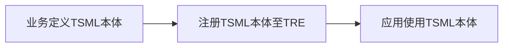
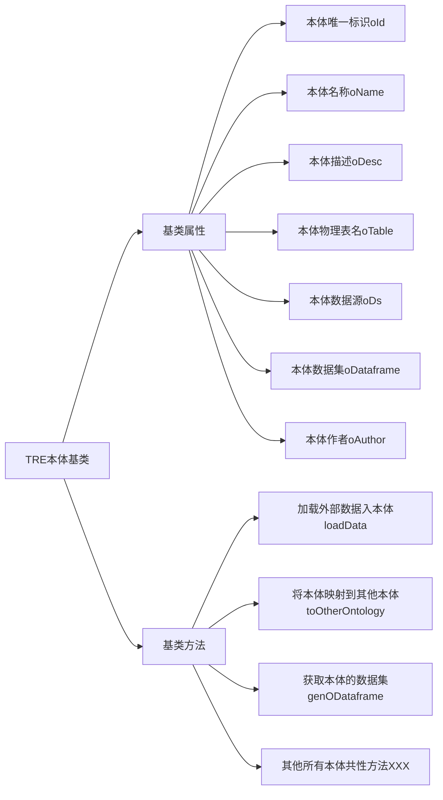
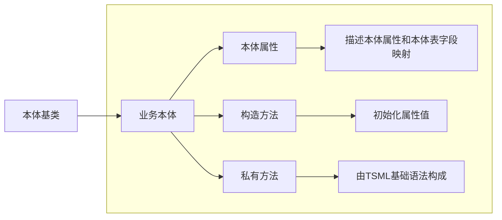

# TSML本体语法定义与开发指导手册

##  1 本体定义使用流程



流程使用说明：

1、业务基于TSML本体定义语法定义本体，每个本体为一个TSML文件，【参见2.4.2】。

2、本体TSML文件通过两种方式注册到TRE引擎，一种通过TRE-SDK的注册接口，另一种通过文件上传到指定目录，TRE自动热加载本体文件，【参见3.1和3.2】。

3、业务在TSML语法中直接创建本体对象，使用本体对象的属性和方法，【参见2.4.3】。

## 2 本体定义语法规范

TRE引擎默认提供一个本体基类，所有业务定义的本体必须继承本体基类，本体基类的定位是用于抽象业务本体的公共属性和公共方法，由TRE统一维护和修订。

### 2.1 本体基类

本体基类提供三个基类方法：loadData()、toOtherOntology()、genODataframe()。

**loadData()：**用于加载外部表数据入本体，该方法入参是一个外部数据集，用户使用时通过TSML基础语法构造好外部数据集，调用此方法给本体注入数据；业务也可以重写此方法实现，内置好本体数据加载逻辑，用户直接开箱即用，【参见2.4.3的示例1和2】；

**toOtherOntology()：**用于本体与本体之间数据的传递，【参见2.4.3的示例5】；

**genODataframe()：**可获取本体的数据集，用于本体和TSML基础算子进一步运算，【参见2.4.3的示例4】；

**depend()：**本体存在外部依赖时，通过此方法设置依赖数据集。

**本体基类结构如下：**


### 2.2 本体建表

本体注册自动建表，元数据信息通过注解注入

表注解@Table参数说明

| 参数名称       | 中文名称 | 参数类型    | 是否必填 | 描述                                       |
| :--------- | ---- | ------- | ---- | ---------------------------------------- |
| remarks    | 表注释  | String  | 否    |                                          |
| type       | 表类型  | String  | 否    | 值为ORC、FRC、MAGICTABLE，FMDB/HIVE默认值为ORC，关系型数据库忽略该参数 |
| readOnly   | 表只读  | boolean | 否    | 表是否只读，默认只读true，只读条件下无法修改本体物理表            |
| properties | 表属性  | 数组      | 否    | 遵守数据库建表语法中的表属性，例如@KeyValue(key="table.ttl", value= "8640000") |

列注解@Column参数说明

| 参数名称               | 中文名称    | 参数类型    | 是否必填 | 描述                                   |
| ------------------ | ------- | ------- | ---- | ------------------------------------ |
| cName              | 列中文名称   | String  | 否    |                                      |
| dataTypeName       | 数据类型名称  | String  | 否    | 默认值为String                           |
| remarks            | 列说明     | String  | 否    |                                      |
| dataLength         | 数据长度    | int     | 否    |                                      |
| decimalDigits      | 小数位     | int     | 否    |                                      |
| nullable           | 是否允许为空  | boolean | 否    | 默认true可为空                            |
| partition          | 是否为分区字段 | boolean | 否    | 默认false非分区                           |
| primaryKey         | 是否主键    | boolean | 否    | 默认false非主键                           |
| originalColumnName | 原始字段名称  | String  | 是    | 仅用于FRC分区字段                           |
| partitionRule      | 分区规则    | String  | 否    | 仅用于FRC分区字段，目前支持 yyyy、yyyyMM、yyyyMMdd |
| positionIndex      | 位置索引    | int     | 否    | 位置索引【经度设置1，维度设置2】，用于自动创建物化视图         |

### 2.3 业务本体

业务本体开发要求：

1、定义本体版本号，版本号：v1、v2、v3...依次自增，在定义的本体类第一行通过package v1来指定版本号；

2、业务本体需要继承本体基类；

3、业务本体需要定义该本体的属性有哪些，属性值为该属性对应的物理表字段名，例如：groupId=“group_id”，本体没有物理表的情况下，属性对应的字段名也需要定义一套虚拟字段名，例如：wxId="wx_id"；

4、业务本体构造方法，需要初始化基类oId、oName、oDesc、oTable、oAuthor属性值，TRE加载时将对属性是否必须进行校验；

| 属性名        | 是否必须 | 规范要求                                     |
| ---------- | ---- | ---------------------------------------- |
| oId        | 是    | 本体唯一标识，约定命名规范：{业务代号}\_{本体分类编码}_{本体编号}。   |
| oName      | 是    | 本体对外的统一中文名称，例如：群聊本体。                     |
| oDesc      | 是    | 本体的描述，可以包含本体的属性描述、本体的方法描述、本体的使用场景等。      |
| oTable     | 否    | 本体对应的物理表名称，如果本体没有对应的物理表名不用赋值，对应的虚拟字段名称直接用属性名称赋值。 |
| oAuthor    | 是    | 本体定义的作者，使用工号填写。                          |
| oDs        | 否    | 本体物理表所在数据源，由应用方使用本体时定义初始化，例如：v1.Chat chat = new v1.Chat(oDs:fmdb)。 |
| oDataframe | 否    | 本体物理表对应的数据集，由loadData()初始化自动赋值。          |

5、业务本体私有方法的开发，私有方法体由TSML基础语法构成，业务可以总结该本体的常用操作进行封装，方便上层应用开箱即用，提升应用效率，【参见2.4.3的示例3】。

**业务本体结构如下：**



### 2.4 TSML本体示例

#### 2.4.1 本体基类示例

业务只能使用，不能自行修改。

```groovy
/**
 * 本体对象基类
 * @version 1.0
 * @date 2025/11/07
 */
abstract class Ontology implements GroovyInterceptable {
    // 本体ID
    String oId
    // 本体名称
    String oName
    // 本体描述
    String oDesc
    // 本体物理表名
    String oTable
    // 本体作者
    String oAuthor
    // 本体物理表所在数据源
    CmdDatasource oDs
    // 本体物理表对应的数据集
    CmdDataframe oDataframe
    // 依赖数据集合
    CmdDataframe[] depends
    // 本体漂移地市
    String[] areaCodes
    // 本体查询数据集
    CmdDataframe queryDataframe
    // 拦截方法的深度
    int depth = 0

    void setoDs(CmdDatasource oDs) {
        // 本体多次设置数据源,卸载掉原数据源算子
        if (this.oDs != null) {
            Register.unregisterOperator(this.oDs.operator)
        }
        // 注册本体时会初始化,该执行直接跳过
        if (Register.getContext() != null) {
            // 生成本体标记算子(用于本体构造)
            def variableName = getVariableInfo().getVariableName() // 获取脚本中对象引用变量
            def ontologyLabel = new OntologyLabel(OntologyLabel.CONSTRUCTOR_CALL, variableName, this.class.name)
            // 给数据源算子打本体构造标记
            oDs.operator.setOntologyLabel(ontologyLabel)
        }
        this.oDs = oDs
    }

    /**
     * 本体新增物理表字段
     *
     * @param columnInfo
     * @return
     */
    Ontology addColumns(String fields) {
        OntologyUtil.addColumns(oDs, oTable, fields)
        return this
    }

    /**
     * 本体删除物理表
     *
     * @param columnInfo
     * @return
     */
    Ontology dropTable() {
        OntologyUtil.dropTable(oDs, oTable)
        return this
    }

    /**
     * 获取本体全部地市的查询结果Dataframe
     *
     * @return
     */
    CmdDataframe getQueryDataframe() {
        // 初始化areaCode
        if (null == areaCodes) {
            areaCode(Register.defaultAreaCode)
        }
        return getQueryDataframe(areaCodes)
    }

    /**
     * 获取本体某地市的查询结果Dataframe
     *
     * @return
     */
    CmdDataframe getQueryDataframe(String... areaCodes) {
        // 初始化本体查询Dataframe
        if (null == queryDataframe) {
            queryDataframe = genODataframe()
        }
        queryDataframe = queryDataframe.ontologyQuery(areaCodes)
        return queryDataframe
    }
    /**
     * 本体依赖的外部数据集
     * @param depends
     */
    void depend(CmdDataframe... depends) {
        this.depends = depends
    }

    Ontology areaCode(String... areaCode) {
        this.areaCodes = areaCode
        return this
    }
    /**
     * 加载外部数据集入本体
     * @param outerData
     * @return 本体数据集
     */
    CmdDataframe loadData(CmdDataframe outerData) {
        oDataframe = oTable == null ? outerData : outerData.to(oDs, oTable)
    }
    /**
     * 将本体映射到其他本体
     * @param other 其他本体
     * @return
     */
    void toOtherOntology(Map mapping, Ontology other) {
        // 1.设置映射关系
        def ontologyThis = genODataframe().mapping(mapping);
        // 2.将本体的结果数据集赋值给其他本体的数据集属性
        other.oDataframe = ontologyThis.to(oDs, other.oTable)
    }
    /**
     * 获取本体的数据集
     * @return
     */
    CmdDataframe genODataframe() {
        if (oTable == null && oDataframe == null) {
            throw new IllegalStateException("该本体没有物理表且未加载数据，请先加载数据后再使用")
        }
        if (null == areaCodes || areaCodes[0] == Register.defaultAreaCode) { // 本地执行
            def fieldMap = OntologyUtil.parseAttributeFieldMapping(this.class)
            def logger = TreLoggerFactory.getLogger()
            logger.info("本体{}属性和字段映射关系,{}", this.class.name, fieldMap)
            return oDataframe != null ? oDataframe.mapping(fieldMap) : from(oDs, this.oTable).mapping(fieldMap)
        } else { // 多地执行
            if (oDataframe != null) {
                return oDataframe
            } else {
                return from(oDs, this.oTable)
            }
        }
    }

    // ==================方法拦截打标========================= //

    Object invokeMethod(String name, Object args) {
        if (name == "beginMethodCall" || name == "endMethodCall") {
            return metaClass.invokeMethod(this, name, args)
        }
//        System.out.println(" Call to  $name  intercepted... ")
        boolean isOutermost = (depth == 0)
        if (isOutermost) {
            // 获取脚本中对象引用变量和本体类名
            List<VariableInfo> variableInfos = Register.getContext().getProperty("VariableInfo")
            if (Util.isEmpty(variableInfos)) {
                throw new RuntimeException("脚本中未解析出本体类" + this.class.name)
            }
            VariableInfo variableInfo
            for (VariableInfo variable : variableInfos) {
                if (variable.getClassName().equals(this.class.name)) {
                    variableInfo = variable
                    break
                }
            }
            if (variableInfo == null) {
                throw new RuntimeException("脚本中未解析出本体类" + this.class.name)
            }
            beginMethodCall(variableInfo.getVariableName(), name, args)
        }
        depth++
        Object result
        try {
            result = metaClass.invokeMethod(this, name, args)
        } finally {
            depth--
            if (isOutermost) {
                endMethodCall(name)
                depth = 0
            }
        }
        return result
    }

    void beginMethodCall(String variableName, String methodName, Object args) {
//        System.out.println("start")
        if (areaCodes != null && (areaCodes[0] != Register.defaultAreaCode || areaCodes.size() > 1)) {
            // 处理方法参数
            List<Object> methodArgs
            if (args == null) {
                methodArgs = new ArrayList<>()
            } else {
                def length = Array.getLength(args)
                methodArgs = new ArrayList<>(length)
                for (int i = 0; i < length; i++) {
                    methodArgs.add(Array.get(args, i))
                }
            }
            // 注册本体标记
            OntologyLabel label = new OntologyLabel(OntologyLabel.METHOD_CALL, variableName, this.class.name, methodName, methodArgs)
            Register.getContext().getProperties().putIfAbsent("ontologyLabel", label)
        }
    }

    void endMethodCall(String methodName) {
//        System.out.println("end")
        // 卸载本体标记
        Register.getContext().getProperties().remove("ontologyLabel")
    }

    // ==================查询语法========================= //

    void init() {
        // 初始化areaCode
        if (null == areaCodes) {
            areaCode(Register.defaultAreaCode)
        }
        // 初始化本体查询Dataframe
        if (null == queryDataframe) {
            queryDataframe = genODataframe()
        }
    }

    Ontology select(String... columnExprs) {
        init()
        queryDataframe = queryDataframe.select(columnExprs)
        return this
    }

    Ontology mapping(Map<String, String> exprs) {
        init()
        queryDataframe = queryDataframe.mapping(exprs)
        return this
    }

    Ontology where(String whereExpr) {
        init()
        queryDataframe = queryDataframe.where(whereExpr)
        return this
    }

    Ontology sort(String... orderColumns) {
        init()
        queryDataframe = queryDataframe.sort(orderColumns)
        return this
    }

    Ontology index(String index) {
        init()
        queryDataframe = queryDataframe.index(index)
        return this
    }

    Ontology limit(int offset = 0, int size) {
        init()
        queryDataframe = queryDataframe.limit(offset, size)
        return this
    }

    Ontology distinct(String... distinctColumns) {
        init()
        queryDataframe = queryDataframe.distinct(distinctColumns)
        return this
    }

    Ontology to(CmdDatasource datasource, String targetTableName) {
        init()
        queryDataframe = queryDataframe.to(datasource, targetTableName)
        return this
    }

    Ontology to(CmdDatasource datasource, String targetTableName, String targetTableFields) {
        init()
        queryDataframe = queryDataframe.to(datasource, targetTableName, targetTableFields)
        return this
    }

    Ontology nodeId(String nodeId) {
        init()
        queryDataframe = queryDataframe.nodeId(nodeId)
        return this
    }

    // ==================插入、更新、删除语法========================= //
    /**
     * 本体插入数据
     * @param record
     * @return
     */
    Ontology save(Map<String, Object> record) {
        if (oTable == null) {
            throw new RuntimeException("本体没有物理表,无法插入数据")
        }
        OntologyUtil.save(this.class.name, oDs, oTable, record)
        return this
    }
 
    /**
     * 本体删除数据
     * @param expr
     * @return
     */
    Ontology delete(String expr) {
        if (oTable == null) {
            throw new RuntimeException("本体没有物理表,无法删除数据")
        }
        OntologyUtil.delete(oDs, oTable, expr)
        return this
    }

    // ==================返回结果语法========================= //

    Ontology returnDf() {
        init()
        def tempTableName
        if (queryDataframe.operator instanceof ToOperator) {
            tempTableName = ((ToOperator) queryDataframe.operator).targetTableName
        } else {
            tempTableName = genOntologyTempTableName()
            queryDataframe = queryDataframe.to(oDs, tempTableName)
        }
        queryDataframe = queryDataframe.ontologyQuery(areaCodes)

        // 本地本体查询去记录结果表信息
        if (areaCodes.size() == 1 && areaCodes[0] == Register.defaultAreaCode) {
            def areaCode = areaCodes[0]
            def dbType = ((DatasourceOperator) oDs.operator).getDsInfo().getType().name
            def dbResourceId = ((DatasourceOperator) oDs.operator).getDsInfo().getDbResourceId()
            def db = ["resultTable": tempTableName, "dbType": dbType, "dbResourceId": dbResourceId, "ontoClass": this.class.name]
            def resultTableMap = Register.getContext().getTask().getResultTables()
            if (resultTableMap.containsKey(areaCode)) {
                resultTableMap.get(areaCode).add(db)
            } else {
                def list = new ArrayList<Map<String, String>>()
                list.add(db)
                resultTableMap.put(areaCode, list)
            }
        }
        return this
    }

    /**
     * 获取脚本中对象信息(变量和方法调用链)
     * @return
     */
    VariableInfo getVariableInfo() {
        // 获取脚本中对象引用变量和本体类名
        List<VariableInfo> variableInfos = Register.getContext().getProperty("VariableInfo")
        if (Util.isEmpty(variableInfos)) {
            throw new RuntimeException("脚本中未解析出本体类" + this.class.name)
        }
        for (VariableInfo variableInfo : variableInfos) {
            if (variableInfo.getClassName().equals(this.class.name)) {
                return variableInfo
            }
        }
        throw new RuntimeException("脚本中未解析出本体类" + this.class.name)
    }

}
```

